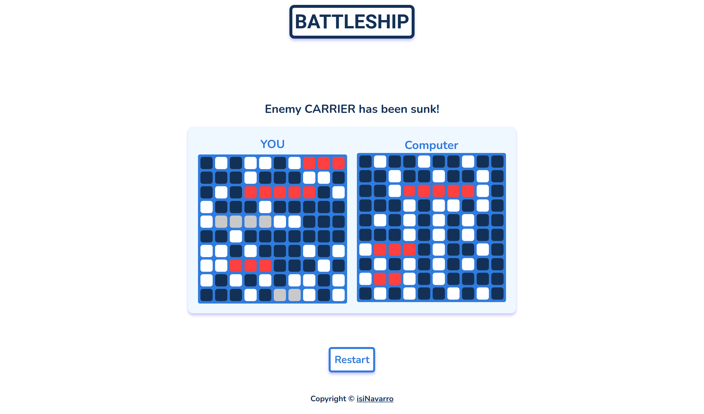

<h1 align="center" id="title">BATTLESHIP</h1>

This project was part of The Odin Project's JavaScript curriculum. The main goal of this project was to apply test-driven development (TDD) concepts to creating a Battleship game using JavaScript. Once in the game, the player first selects where the ships will be placed on the gameboard. The computer will do likewise automatically. After the initial setup the game starts with the player and the computer alternating movements on each other gameboards. The first to sink all the opponent's ships wins the game. This project was made using HTML, CSS and JavaScript. Webpack and jest were used to bundle and test the files respectively.

<h2>🚀 Live Demo</h2>

[https://isinavarro.github.io/odin-Battleship/](https://isinavarro.github.io/odin-Battleship/)

<h2>Project Screenshots:</h2>

<h2>🧐 Features</h2>

Here're some of the project's features:

- Game created only objects (classes)
- Functionality tested using Jest

<h2>💻 Built with</h2>

Technologies used in the project:

- Vanilla JavaScript
- CSS
- HTML
- Webpack
- Babel
- npm
- Jest
